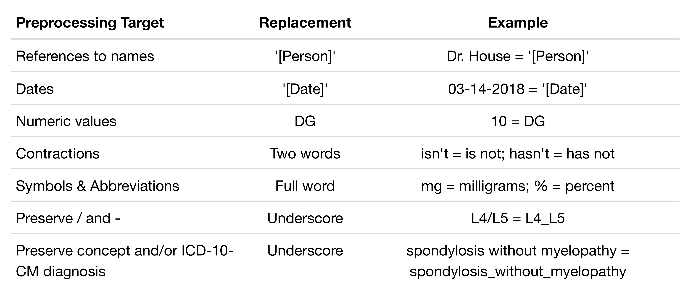

```{r setup, include=FALSE}
options(htmltools.dir.version = FALSE)
```

```{r xaringan-themer, include = FALSE}
library(xaringanthemer)
#mono_light(
#  base_color = "#442416"
  ##header_font_google = google_font("Josefin Sans"),
  #text_font_google   = google_font("Montserrat", "300", "300i"),
  #code_font_google   = google_font("Droid Mono")
#)
# duo_accent(primary_color = "#8b6f4e", secondary_color = "#fcc30f")

duo_accent_inverse(primary_color = "#8b6f4e", secondary_color = "#fcc30f",
  white_color = "#FFFFFF", black_color = "#000000",
  background_image = "images/W-gold-brown.png",
  background_size = "48px",
  background_position = "bottom 30px right 25px")
  #title_slide_background_image = "images/wordcloud.jpg", 
  #title_slide_background_size = "250px",
  #title_slide_background_position = "bottom 25px right 325px")
  
  # text_color = black_color, header_color = primary_color,
  # background_color = white_color,
  # link_color = choose_dark_or_light(secondary_color, primary_color,
  # secondary_color), text_bold_color = choose_dark_or_light(secondary_color,
  # primary_color, secondary_color), text_slide_number_color = primary_color,
  # padding = "1em 4em 1em 4em", background_image = NA,
  # background_size = NA, background_position = NA,
  # code_highlight_color = "rgba(255,255,0,0.5)",
  # code_inline_color = choose_dark_or_light(secondary_color, primary_color,
  # secondary_color), code_inline_background_color = NA,
  # code_inline_font_size = "1em", inverse_background_color = secondary_color,
  # inverse_text_color = choose_dark_or_light(secondary_color, black_color,
  # white_color), inverse_text_shadow = FALSE,
  # inverse_header_color = choose_dark_or_light(secondary_color, black_color,
  # white_color), title_slide_text_color = choose_dark_or_light(primary_color,
  # black_color, white_color), title_slide_background_color = primary_color,
  # title_slide_background_image = NA, title_slide_background_size = NA,
  # title_slide_background_position = NA, footnote_color = NA,
  # footnote_font_size = "0.9em", footnote_position_bottom = "3em",
  # left_column_subtle_color = apply_alpha(primary_color, 0.6),
  # left_column_selected_color = primary_color,
  # blockquote_left_border_color = apply_alpha(secondary_color, 0.5),
  # table_border_color = "#666", table_row_border_color = "#ddd",
  # table_row_even_background_color = lighten_color(secondary_color, 0.3),
  # text_font_size = "20px", header_h1_font_size = "55px",
  # header_h2_font_size = "45px", header_h3_font_size = "35px",
  # text_slide_number_font_size = "0.9em", text_font_google = NULL,
  # text_font_family = "'Droid Serif'", text_font_weight = "normal",
  # text_font_url = "https://fonts.googleapis.com/css?family=Droid+Serif:400,700,400italic",
  # text_font_family_fallback = "'Palatino Linotype', 'Book Antiqua', Palatino, 'Microsoft YaHei', 'Songti SC'",
  # text_font_base = "serif", header_font_google = NULL,
  # header_font_family = "'Yanone Kaffeesatz'", header_font_weight = "normal",
  # header_font_url = "https://fonts.googleapis.com/css?family=Yanone+Kaffeesatz",
  # code_font_google = NULL, code_font_family = "'Source Code Pro'",
  # code_font_size = "0.9em",
  # code_font_url = "https://fonts.googleapis.com/css?family=Source+Code+Pro:400,700",
  # code_font_family_fallback = "'Lucida Console', Monaco", extra_css = NULL,
  # extra_fonts = NULL, outfile = "xaringan-themer.css")

```

<!-- # Background: Electronic Medical Record -->

<!-- Great potential for improving all aspects of patient care including [1]: -->

<!--  -->

<!-- ??? -->

<!-- - Safety -->

<!--    - Effectiveness -->

<!--    - Patient-centeredness -->

<!--    - Communication -->

<!--    - Education -->

<!--    - Timeliness -->

<!--    - Efficiency -->

<!--    - Equity [1] -->

# Background: Lack of User-Centered Design

The electronic format is not fully optimized for clinicians' workflow and has introduced several barriers:

- Difficulty searching for patient data (McDonald et al., 2014)

- Poor readability & redundancy (Farri et al., 2012)

- Reduced efficiency (Young et al., 2018)

- Increased clerical burden & increased risk of physician burnout (Shanafelt et al., 2016)

<br />

<font color=#fcc30f>"The real art of medical diagnosis comes in seeing the connections between problems—something that was well-documented on paper, perhaps because we weren’t so exhausted from all the thunderous clicks that we still had the time and energy to actually think about the case and the context."</font> 

--Dr. Robert Wachter (2012)


???

- 2. Nearly 41% of internists reported that finding and reviewing medical record data took more overall time
to perform using the electronic medical record (EMR) than before the use of electronic formats
(McDonald et al., 2014). 

- 4. In one study, it was found that primary care physicians (PCPs) spend
more than one-half of their work day, nearly six hours, interacting with the EHR (Arndt et al.,
2017).

- Researchers also found the number of mouse clicks within the EMR commonly exceeds 400 times per hour for every 2.5 patients seen by the physician (Hill et al., 2013). Over the course of a day, a physician could easily register over 4,000 mouse clicks in an attempt to access or enter information for a patient visit. 

---

# Background: Communication & Sharing

<br />

.pull-left[
<font color=#fcc30f>Problem:</font>

Natural language processing + artificial intelligence = difficult communication! 

<br />

<font color=#fcc30f>Problem:</font>

Patients show a growing desire to read their note, but readability and low health literacy is a concern (White & Danis, 2013)

]
.pull-right[
<font color=#fcc30f>Solution:</font> 

Implement stakeholders in the earliest phases of predictive analytics development (Cohen et al., 2014)

<br />

<font color=#fcc30f>Solution:</font> 

Automate the simplification of the note (Paetzold & Specia, 2017)
]

???

Include FDA device regulation?

---

# Purpose of Study

Using chronic pain patient notes within the electronic medical record (EMR), the objectives of this study were to:

<font color=#fcc30f>1.</font> Evaluate word embeddings to determine an appropriate model that captures semantic (i.e., meaning) and syntactic (i.e., language) content of the patient note for downstream applications.  

<br />

<font color=#fcc30f>2.</font> Examine the current subject matter and structure of patient notes to discover the level of personalized information important to patient care. 

<br />

<font color=#fcc30f>3.</font> Identify ways that physicians could be incorporated into the process of artificial intelligence for health care.

---

# Methods: Sample

- Secondary data analysis of patient notes between October 1, 2015 and March 31, 2018

- Michigan Pain Consultants
    - Interdisciplinary, outpatient pain management
    
    - 21 providers within six clinics
    
    - EMR: GE Centricity Practice Solutions 

- Chronic pain patients 21 years and older with non-malignant chronic pain
    - 29,990 patients (60.8% female, mean age: 59.7 years)
    
    - 197,731 patient notes
    
???
    - Pain lasting more than three months
    
    - Other treatment strategies in primary care have failed
    
- Patients disbursed across six different pain management clinics in Michigan
    - Michigan Pain Consultants
    
    - 14 providers specializing in interventional pain management

---

# Methods: Text Preprocessing

#### Table 1. Text preprocessing for word embedding models



---

# Methods: Word Embeddings

<font color=#fcc30f>
You shall know a word by the company it keeps... (Firth, 1957)
</font>

<br />
- At its core, a word embedding transforms words into numbers

- First step (layer) in deep neural networks for downstream applications

- Word embeddings are commonly divided between 
    1. Co-occurrence models
    
    2. Prediction models
    
---

# Methods: Word Embeddings

1. Co-occurrence models
    - Based on words frequently appearing together
    
    - Global Vectors <font color=#fcc30f>(GloVe)</font>
    
2. Prediction models
    - Predict context (i.e., surrounding) word or target word

    - <font color=#fcc30f>Word2vec</font> - word n-grams
    
    - <font color=#fcc30f>fastText</font> - character n-grams + word n-grams

---

# Example of Co-occurrence Matrix:

### I enjoy flying. I like NLP. I like deep learning.


---


---
<!-- # Methods: Word Embeddings -->

<!-- Many parameters to consider for each of the models: -->

<!-- - Dimension size (e.g., 50, 300, 1000) -->

<!-- - Window size (e.g., 5, 8, 10) -->

<!-- - Negative sampling (e.g., 5, 10) -->

<!-- - Epochs (e.g., 10, 25, 50) -->

<!-- - Skip-gram vs Continuous Bag of Words (CBOW) -->

<!-- - Minimum word counts (e.g., 2, 5, 50) -->

<!-- ??? -->

<!-- - Dimension: how many numbers represent a word -->
<!-- - Window size: how many words to consider to the left and right of a target word -->
<!-- - Negative sampling: modifies just a small percentage of the weights instead of for all words -->
<!-- - Epochs: iterations -->

<!-- In the "skip-gram" mode alternative to "CBOW", rather than averaging the context words, each is used as a pairwise training example. That is, in place of one CBOW example such as [predict 'ate' from average('The', 'cat', 'the', 'mouse')], the network is presented with four skip-gram examples [predict 'ate' from 'The'], [predict 'ate' from 'cat'], [predict 'ate' from 'the'], [predict 'ate' from 'mouse']. (The same random window-reduction occurs, so half the time that would just be two examples, of the nearest words.) -->

<!-- --- -->

# Methods: Word Embeddings

#### Table 2. Parameters used for word embedding models


<font color=#fcc30f>a)</font> 100 and 300 were also tested; <font color=#fcc30f>b)</font> 5 was also tested; <font color=#fcc30f>c)</font> predict context words given target word
 
???

Based on a priori testing, the following parameters were chosen for each of the three models.

- Dimension: how many numbers represent a word
- Window size: how many words to consider to the left and right of a target word
- Negative sampling: modifies just a small percentage of the weights instead of for all words
- Epochs: iterations

- Each model took between 20 minutes and 14 hours to run with over 30 models created. 
- The models with the parameters above were retained for intrinsic and extrinsic evaluation.

---

# Methods: Intrinsic Evaluation

<font color=#fcc30f>Semantic relatedness and similarity of words:</font>

1. Word similarity & analogies (cosine similarity)
    - king:queen::man:woman
    
    - perfect: perfection, perfectly, ideal, flawless, good, always
    
2. Word clustering
    - t-distributed stochastic neighbor embedding (t-SNE) + principal components analysis (PCA)
            
    - k-Nearest Neighbors (kNN) with Louvain community detection

3. Expert/Physician Review
    - Interactive dashboard
    
???

2. Word clustering (similar words in close proximity grouped together)
    - t-distributed stochastic neighbor embedding (t-SNE) + principal components analysis (PCA)
        - Collapses many dimensions (200) down to 2
        
    - k-nearest neighbors (KNN) with Louvain community detection (similar to network analysis)
        - Groups similar words

Interactive dashboard that includes both 1) and 2)

---


---

# Methods: Extrinsic Evaluation

Extrinsic methods assess the impact of the system on specific task performance
based on measures such as success rate, time-to-completion, and decision-making accuracy (Wang et al., 2018).

<br />

- No good domain-specific (chronic pain), health care ontologies exist for evaluation 

- Possible downstream application aim to simplify the patient note

<br />

<font color=#fcc30f>Predict text readability (grade level) of the patient note utilizing the word embeddings.</font>
    
---

# Methods: Extrinsic Evaluation
    
- Three readability formulas:
    1. <font color=#fcc30f>Flesch-Kincaid Grade:</font> Average number of words per sentence, number of syllables per word
    
    2. <font color=#fcc30f>Gunning Fog Index:</font> Average number of words per sentence, percentage of words with more than two syllables
    
    3. <font color=#fcc30f>SMOG Readability Formula:</font> Number of words with more than two syllables
    
- Convolution neural network (CNN)
    - Several configurations of hyperparameters (e.g., learning rate, dropout) were tested for optimization
    
    - Training: 70%; Validation: 30%; 
    
    - 150 epochs (i.e., iterations)

---

# Results: Exploratory Data Analysis

<br />

- 127,898,136 tokens (i.e., words, concepts)

- Unigrams: 39,337 (min = 5)
  
- Bigrams: 275,455 (min = 5)

- Mean word count per patient note: 626 (IQR: 519-748)
  
- Range of mean word count by provider: 481 to 1001 words per patient note
  
---

#### Figure 1. Most frequently occurring unigrams


---

#### Figure 2. Most frequently occurring bigrams


---

#### Figure 3. Mean word count by provider


---

#### Figure 4. Similarity of Patient Notes Among Providers


---

#### Figure 5. Mean word count by provider type


---

# Results: Exploratory Data Analysis

<font color=#fcc30f>Text collocation analysis:</font> phrase detection based on some number of words that occur together often

- Revealed the use of templates (and copy/paste) for patient notes
  
- 63,529,789 of the 72,033,968 (88.2%) phrases of 2-7 word length were part of larger phrases/sentences
  
- Possible tool for concept, diagnosis, co-morbidity, or diagnostic test detection:
    - "facet signs positive on right"
    
    - "Tender cervical facets with side bending"
    
    - "Patrick's test positive"
    
    - "Today discussed opioid use"

???

- closer to 481 = structured notes
- closer to 1001 = offered narrative text (Assessment in SOAP note)

---

# Results: Intrinsic Evaluation

#### Table 3. Top five words most similar to spondylosis


---

# Results: Intrinsic Evaluation

#### Table 4. Top five words most similar to oxycodone


---

# Results: Intrinsic Evaluation

#### Table 5. Top five words most similar to l5 (5th lumbar) 


---

# Results: Intrinsic Evaluation

<font color=#fcc30f>bid:tid::two: ?</font>


Numbers in parentheses represent the distance metric for measuring similarity (0-1)

---

#### Figure 6. Word2vec (200 dimensions) t-SNE and clustering


---

#### Figure 6. Word2vec (200 dimensions) t-SNE and clustering


---

# Results: Intrinsic Evaluation - Physician Feedback

- Five physicians gave feedback by using the Word Explorer dashboard
  
  - Three physicans favored Word2vec 200
  
  - One physician favored Word2vec 50 
  
  - One physician did not have a preference between fastText 50 and fastText 200
  
<br />
  
<font color=#fcc30f>
.center["Word2vec 50 seemed closest to my way of associating."]
</font>

---

<!-- #### Figure 1. Word2vec (200 dimensions) t-SNE and clustering -->

<!--  -->

<!-- Zooming in on Medications and Diagnoses groups -->

<!-- --- -->

#### Table 6. Groups as determined by clustering algorithm

<iframe src="images/Table1_new.html"
        height="600" width="100%"
        scrolling="yes" seamless="seamless"
        frameBorder="0">
</iframe>

???

Values in () denote the number of groups after accounting for repetitive groupings.

---

# Results: Extrinsic Evaluation

#### Table 7. Derived grades based on readability indices

<iframe src="images/Table3.html"
        height="200" width="100%"
        scrolling="no" seamless="seamless"
        frameBorder="0">
</iframe>

<font color=#fcc30f>*Patient notes and grades with fewer than 500 observations were removed prior to analysis.</font>

---

# Results: Extrinsic Evaluation

#### Table 8. Accuracy for predicting readability of patient note using convolution neural network

<iframe src="images/Table2.html"
        height="300" width="100%"
        scrolling="no" seamless="seamless"
        frameBorder="0">
</iframe>

.footnote[.red.bold[*] <font color=#b91233>Red</font> denotes model with highest predictive accuracy; <font color=#fcc30f>yellow</font> second highest predictive accuracy.]

---

# Results: Dashboard and Provider Feedback

"I know the data in my notes specifically is quite limited as I am not telling too much of a story at all and am more concerned about efficiency, billing requirements for the data in my note, and the information is mostly from the premade templates."


---

# Conclusions: Choosing a Model

<br />

- Word similarity better captured by smaller dimensional models [7]

    - More separation between dissimilar words and clusters

<br />

- Larger dimensional models more effective for complex, downstream tasks, i.e., prediction/classification

    - Word2vec & GloVe (200 dimensions) with highest predictive accuracy

<br />

- No one-size-fits-all model?
    
???

- No one-size-fits-all model?
    - Misspellings, diverse range of content --> dependent upon downstream tasks

---

# Conclusions: Choosing a Model

<br />

- Word2vec 200 appears most robust

<br />

- fastText 200 delivers useful tools (e.g., spellchecker)

<br />

- GloVe 200 seemed to capture some personal level details

<br /> 

- Expert consensus: Word2vec 

---

# Conclusions & Future Directions

<br />

- Missing the <font color=#fcc30f>"A"</font> in the SOAP note
    - Physicians use templates and miss the narrative/story within the patient note
    
    - Large amount of phrase/sentence collocation

<br />

<font color=#fcc30f>
.center[How can the patient narrative be incorporated back into the electronic medical record?]
</font>

---

# Conclusions & Future Directions

<br />

- Continue to explore ways to incorporate stakeholders for AI applications

<font color=#fcc30f>
.center[What other methods can be used?]
</font>
    
<br />

- User-centered design, sharing the patient note, and readability
    - Automated text generation/summarization (physician)
    
    - Automated text simplification (patient)

<font color=#fcc30f>  
.center[Deep neural networks and bolt-on software for EMR...]
</font>

---

# Strengths & Limitations

.pull-left[
<font color=#fcc30f>Strengths:</font> 
- Domain-specific

- Large dataset for patient notes

- State-of-the-art word embeddings

- First attempt of this nature to open up the "black box"
]

.pull-right[
<font color=#fcc30f>Limitations:</font>
- Practice-specific?

- Different software vendors = different functionality

- Word embeddings: hyperparameter selection an active area of research

- No ontology or gold standard for extrinsic evaluation
]

???
    - Physicians reluctant at first
    
    - After accessing the dashboard, they were very responsive and excited
    
---

<br />

<br />

<br />

<br />

<br />


---

# References

McDonald, C., Callaghan, F., Weissman, A., Goodwin, R., Mundkur, M., & Kuhn, T. (2014). Use of Internist's Free Time by Ambulatory Care Electronic Medical Record Systems. JAMA Internal Medicine, 174(11), p.1860.

Farri, O., Pieckiewicz, D. S., Rahman, A. S., Adam, T. J., Pakhomov, S. V., & Melton, G.
B. (2012). A qualitative analysis of EHR clinical document synthesis by clinicians. AMIA ... Annual Symposium proceedings / AMIA Symposium. AMIA Symposium, 2012, 1211- 1220.     

Young, R., Burge, S., Kumar, K., Wilson, J. & Ortiz, D. (2018). A Time-Motion Study of Primary Care Physicians’ Work in the Electronic Health Record Era. Family Medicine, 50(2), pp.91-99.

Shanafelt, T., Dyrbye, L., Sinsky, C., Hasan, O., Satele, D., Sloan, J., & West, C. (2016). Relationship Between Clerical Burden and Characteristics of the Electronic Environment With Physician Burnout and Professional Satisfaction. Mayo Clinic Proceedings, 91(7), pp.836-848.

---

# References

Cohen, I. G., Amarasingham, R., Shah, A., Xie, B., & Lo, B. (2014). The legal and ethical
concerns that arise from using complex predictive analytics in health care. Health Affairs
(Project Hope), 33(7), 1139–1147. https://doi.org/10.1377/hlthaff.2014.0048

White, A., & Danis, M. (2013). Enhancing patient-centered communication and collaboration by using the electronic health record in the examination room. JAMA, 309(22), 2327–2328. https://doi.org/10.1001/jama.2013.6030

Paetzold, G.H., & Specia, L. (2017). Lexical simplification with neural ranking. In EACL, pp.34-40.

Firth, J.R. (1957). A synopsis of linguistic theory 1930–1955. In Studies in Linguistic Analysis, pp. 1–32. Blackwell, Oxford. 

Mikolov, T., Sutskever, I., Chen, K., Corrado, G.S., & Dean, J. (2013). Distributed Representations of Words and Phrases and their Compositionality. CoRR, abs/1310.4546. Retrieved from https://arxiv.org/abs/1310.4546.

---

<br />

<br />

<br />

<br />

<br />

# <a href="http://www.statimpact.org/WordExplorer">Word Explorer</a>

---

#### Figure 7. Word2vec (50 dimensions) t-SNE and clustering


---

#### Figure 8. fastText (50 dimensions) t-SNE and clustering


---

#### Figure 9. fastText (200 dimensions) t-SNE and clustering


---

#### Figure 10. GloVe (50 dimensions) t-SNE and clustering


---

#### Figure 11. GloVe (200 dimensions) t-SNE and clustering


---

Example of Convolution Neural Networks


<!-- .footnote[Example of Convolution Neural Networks] -->


